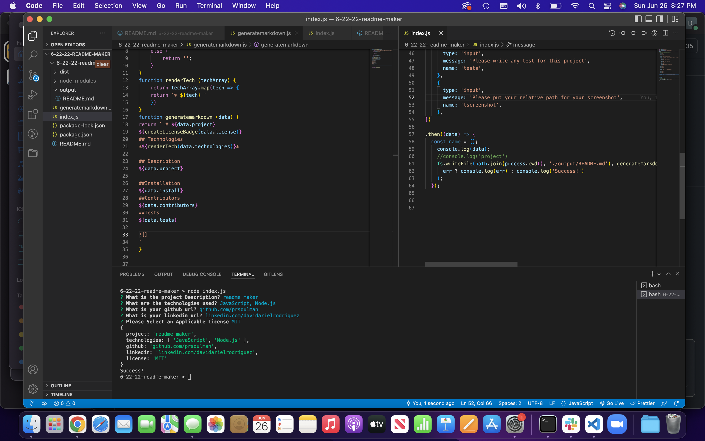

# 6-22-22-readme-maker

##Description: 
this CLI Program made with node.js generates a README.md file for applications.

##Technologies Used:
--Javascript
--node.js
## Description
This program generates README.md files

##Installation
Download, than use command node.index.js
##Contributors
NA
##Tests
NA

https://youtu.be/IyZc7j8iV6c